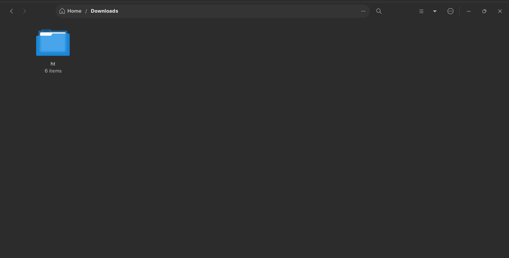
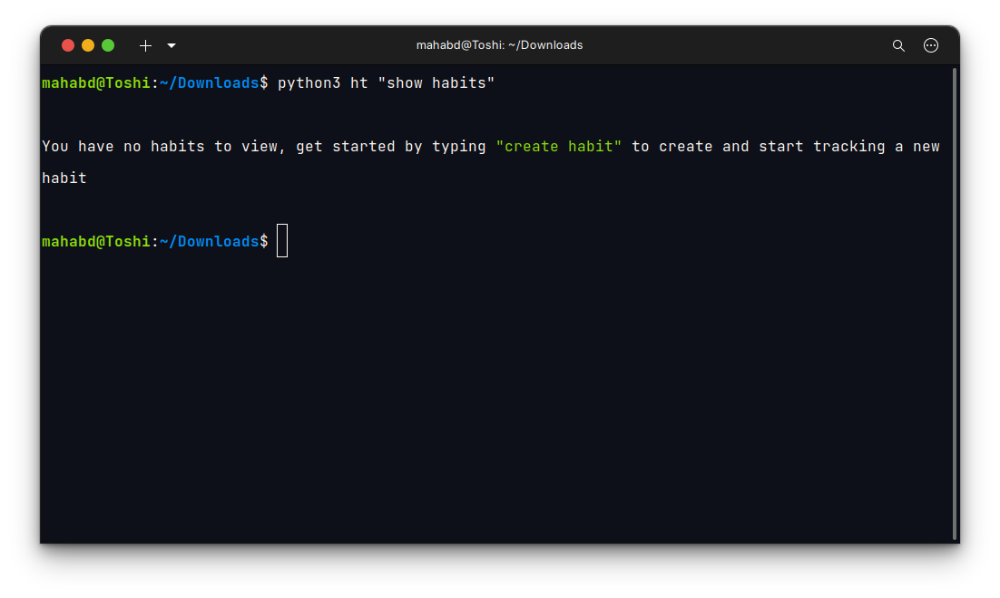

# Habit Tracker Application

A simple habit tracker application that lets you:

- create habits
- delete habits
- complete habits within a period
- view habit details

To view the logic behind the code, visit the [Functionality.md](Functionality.md) file

## Installation

This app was built with `python 3.10.6` and uses the following dependencies:

- SQLite3 for working with the database
- Fire for the command line interface
- Rich for easier styling and formatting of the output
- Unittest for testing purposes

To use this app with python, you must have a version of python equal to or above the specified version. You can install it by visiting the official python website or however you prefer. After the installation it will have installed the python package manager `pip` as well which will be used in the following step.

Then you must install the external dependencies (Rich & Fire). To do so, simply run this command from your terminal

`pip install rich fire`

This should allow you to use the app without issues now.

## Usage

The main application file combining all the code is the `__main__.py` file. The purpose of naming it this is so you can simply go to the directory the habit tracker application folder is located in and type `python (or python3 depending on your installation)` followed by the name of the folder the application is in followed by the command in quotation marks (because some commands have 2 words and a space isn't allowed without surrounding quotation marks) like such:

`python HT_FOLDER_NAME "COMMAND" --parameter=PARAMETER`

Example:

Note:

After you run a command, it will create a database file in the folder you called the command from. This database file contains ALL YOUR HABITS, DELETING IT WILL MAKE YOU LOSE ALL YOUR STORED HABITS.

These are all of the supported commands _(uppercase words are for you to substitute your required values)_:

- help

  - view all the functionality of this application

- create habit

  - --name="NAME"
    - The name you want to give this new habit
  - --period="PERIOD"
    - How often you would like to repeat this habit

- delete habit

  - --name="NAME"
    - The name of the habit you want to delete

- mark done

  - --name="NAME"
    - The name of the habit you want to mark as done

- show habits

  - --period="PERIOD"
    - Shows only habits with this periodicity if specified. Otherwise shows all currently tracked habits

- longest streak

  - --name="NAME"
    - Shows only the longest streak for this habit if specified. Otherwise shows the longest streaks for all currently tracked habits

- view predef habits
  - Shows a table with all the predefined habits and their sample tracking data

Note:

The parameters are optional. If you leave them out and type only the command, you will be guided through the function manually. However, specifying the parameters allows you to quickly use this app.
